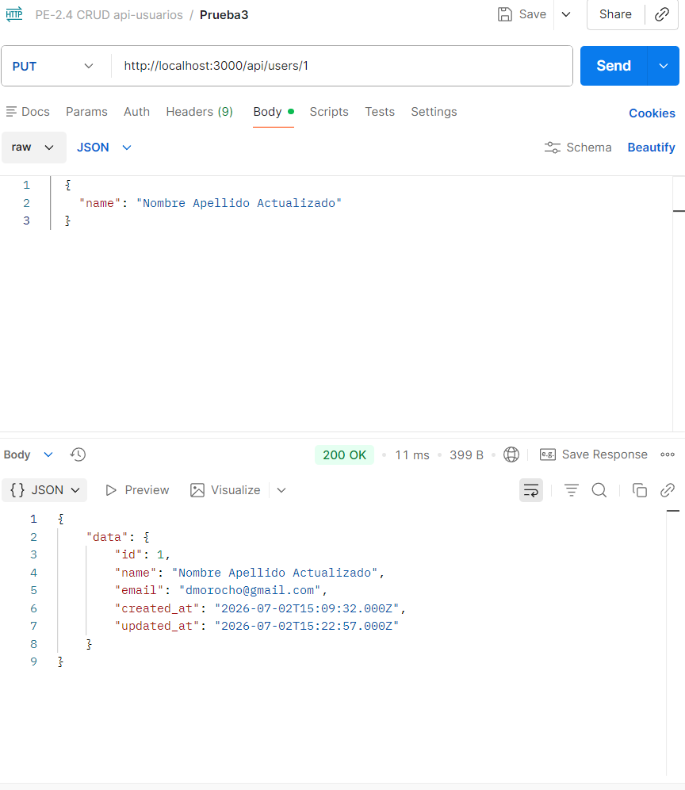
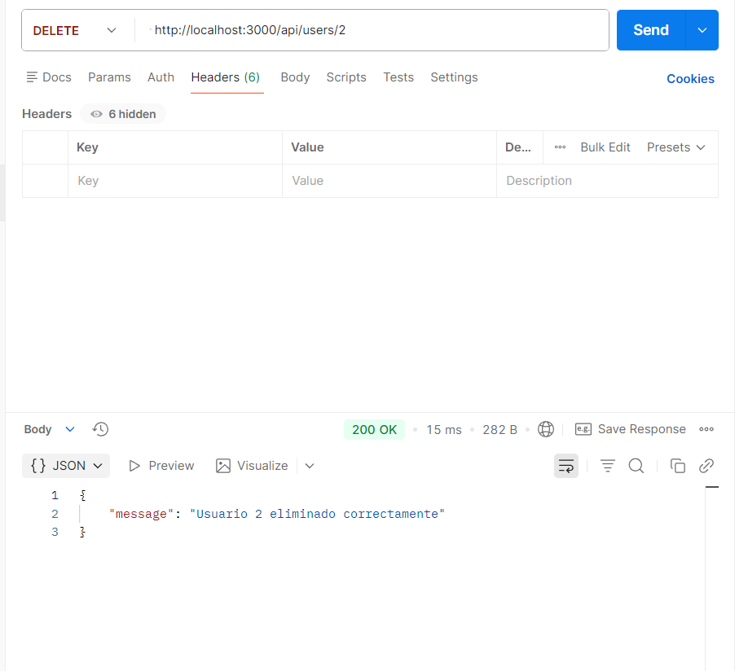
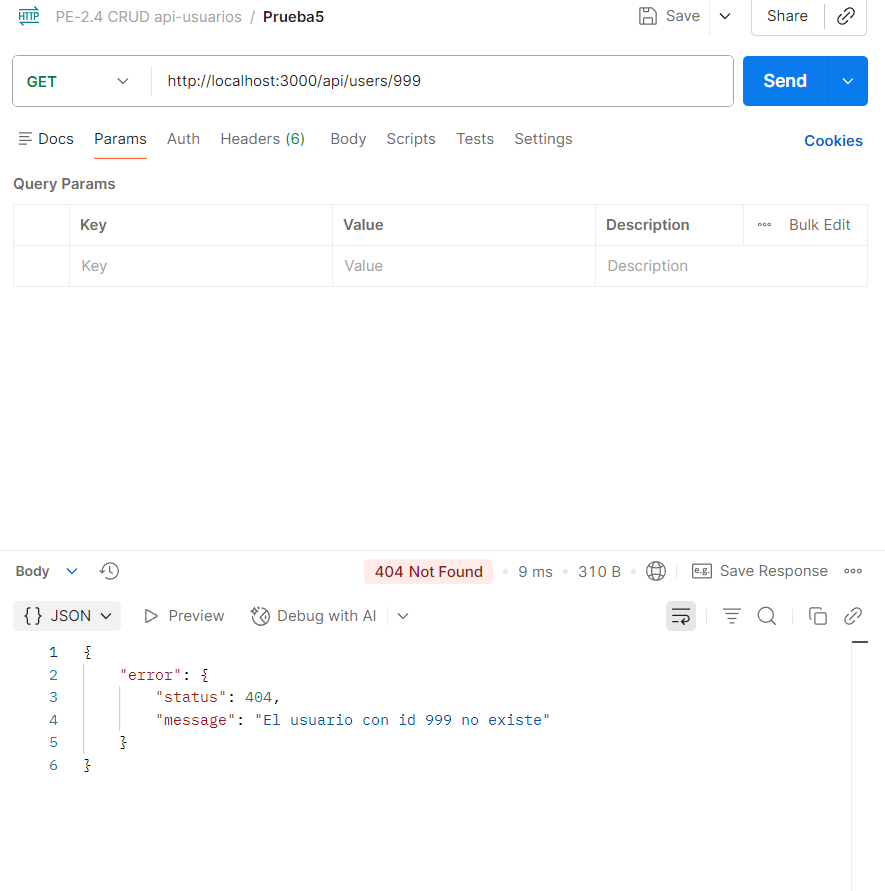

# Evidencias de funcionamiento

## Prueba 1 - Obtener todos los usuarios (GET)

---

## Prueba 2 - Obtener usuario por ID (GET)

---

## Prueba 3 - Crear usuario (POST)

---

## Prueba 4 - Actualizar usuario (PUT)

---

## Prueba 5 - Eliminar usuario (DELETE)

